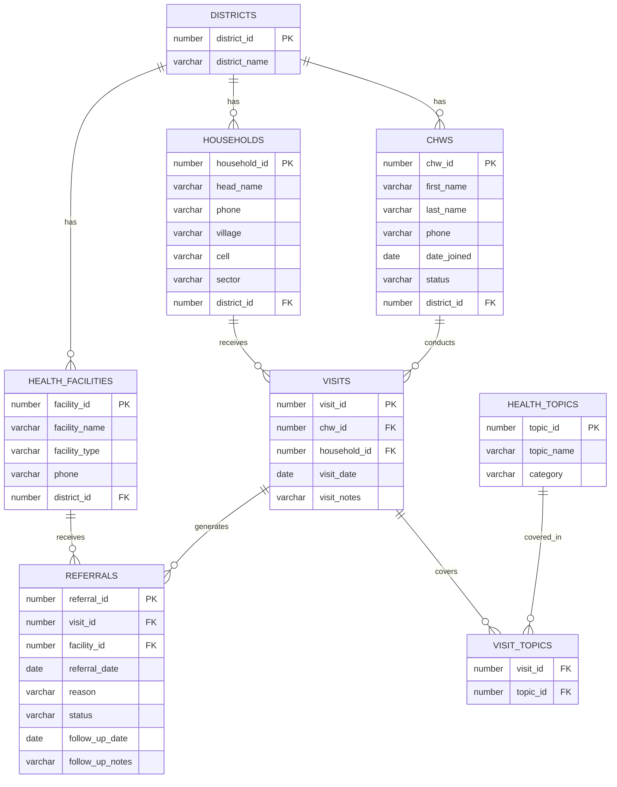

# PHASE III — Logical Database Design
## Community Health Worker (CHW) Outreach & Referral Tracking System
Database/User: `32410_2025_Divin_CHW_DB`

---

## 1. Entities, Attributes, Keys

| Entity | Key Attributes | PK | FK |
|---|---|---|---|
| DISTRICTS | district_id, district_name | district_id | — |
| CHWS | chw_id, first_name, last_name, phone, date_joined, status, district_id | chw_id | district_id → DISTRICTS |
| HOUSEHOLDS | household_id, head_name, phone, village, cell, sector, district_id | household_id | district_id → DISTRICTS |
| HEALTH_TOPICS | topic_id, topic_name, category | topic_id | — |
| HEALTH_FACILITIES | facility_id, facility_name, facility_type, phone, district_id | facility_id | district_id → DISTRICTS |
| VISITS | visit_id, chw_id, household_id, visit_date, visit_notes | visit_id | chw_id → CHWS, household_id → HOUSEHOLDS |
| VISIT_TOPICS | visit_id, topic_id | (visit_id, topic_id) | visit_id → VISITS, topic_id → HEALTH_TOPICS |
| REFERRALS | referral_id, visit_id, facility_id, referral_date, reason, status, follow_up_date, follow_up_notes | referral_id | visit_id → VISITS, facility_id → HEALTH_FACILITIES |
| PUBLIC_HOLIDAYS | holiday_id, holiday_date, holiday_name | holiday_id | — |
| SYSTEM_CONFIG | config_key, config_value | config_key | — |
| AUDIT_LOG | audit_id, table_name, operation, record_id, changed_by, changed_date, old_value, new_value | audit_id | — |

## 2. Relationships

- DISTRICTS (1) — (M) CHWS
- DISTRICTS (1) — (M) HOUSEHOLDS
- DISTRICTS (1) — (M) HEALTH_FACILITIES
- CHWS (1) — (M) VISITS
- HOUSEHOLDS (1) — (M) VISITS
- VISITS (M) — (M) HEALTH_TOPICS, resolved by **VISIT_TOPICS** (a CHW covers several topics in one visit; a topic is covered across many visits)
- VISITS (1) — (M) REFERRALS (a single visit can generate more than one referral)
- HEALTH_FACILITIES (1) — (M) REFERRALS

## 3. ER Diagram (Mermaid — renders directly on GitHub)

## 4. Normalization to 3NF

**1NF:** Every table has a primary key and no repeating groups. The one place repetition could sneak in is "topics covered in a visit" — instead of a comma-separated list in one VISITS column, this is split into the **VISIT_TOPICS** junction table, so each cell holds a single atomic value.

**2NF:** Every table uses a single-column surrogate PK (`*_id`) except VISIT_TOPICS, whose composite key is `(visit_id, topic_id)`. There are no non-key attributes that depend on only *part* of that composite key — VISIT_TOPICS carries no extra descriptive columns, so partial dependency can't occur.

**3NF:** No non-key attribute depends on another non-key attribute (no transitive dependency).
- Example fixed: `district_name` is **not** repeated inside CHWS/HOUSEHOLDS/HEALTH_FACILITIES as free text — each just stores `district_id`, and the name lives once in DISTRICTS.
- Example fixed: `facility_name`/`facility_type` live only in HEALTH_FACILITIES, not duplicated into REFERRALS.
- `follow_up_status` logic is not derived from another stored column — it's the independent fact `status`.

All 10 tables satisfy 3NF.
